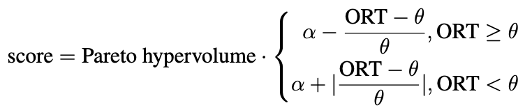
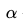
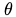

# ICCAD Contest Platform

## Description

The official contest platform for ICCAD'22 contest problem C: Microarchitecture Design Space Exploration of [ICCAD Contest](https://dl.acm.org/doi/10.1145/3508352.3561109).


## Overview

[1. Platform Structure](#1-platform-structure)  
[2. Getting Started](#2-getting-started)  
[3. Run Example Experiments](#3-run-example-experiments)  
[4. Microprocessor Microarchitecture Design Space](#4-microprocessor-microarchitecture-design-space)  
[5. Dataset](#5-dataset)  
[6. Prepare Your Submission](#6-prepare-your-submission)  
[7. Evaluate Your Submission](#7-evaluate-your-submission)  
[8. Contact](#8-contact)  


## 1. Platform Structure

The entire platform structure is as shown below.
```
iccad-contest-platform
├── LICENSE
├── MANIFEST.in
├── README.md
├── docs                                             # documents
│   └── iccad-contest-problem.pdf
├── example_optimizer                                # example optimizer
│   ├── gp-configs.json
│   ├── gp-optimizer.py
│   ├── lr-offline-optimizer.py
│   ├── lr-online-optimizer.py
│   ├── random-search-optimizer.py
│   └── random-search-w-early-stopping-optimizer.py
├── iccad_contest                                    # platform core modules
│   ├── __init__.py
│   ├── abstract_optimizer.py
│   ├── contest-dataset                              # dataset & microarchitecture design space
│   │  ├── README.md
│   │  ├── __init__.py
│   │  ├── contest.csv
│   │  └── design-space.xlsx
│   ├── design_space_exploration.py
│   ├── functions
│   │  ├── __init__.py
│   │  ├── dataset.py
│   │  ├── design_space.py
│   │  ├── hypervolume.py
│   │  └── problem.py
│   ├── utils
│   │  ├── __init__.py
│   │  ├── arguments.py
│   │  ├── basic_utils.py
│   │  ├── constants.py
│   │  ├── numpy_utils.py
│   │  ├── path_utils.py
│   │  └── serialize.py
│   └── version.py
├── misc
│   ├── alpha.png
│   ├── score.png
│   └── theta.png
├── requirements                                    # environment requirements
│   ├── base.in
│   ├── base.txt
│   ├── docs.in
│   ├── docs.txt
│   ├── ipynb.in
│   ├── ipynb.txt
│   ├── optimizers.in
│   └── optimizers.txt
├── setup.py
└── tools
    ├── build-iccad-contest-platform.sh
    └── integration-test.sh
```

Highlights of the contest platform:

* `iccad_contest/design_space_exploration.py`: core functions implementations.
* `iccad_contest/contest-dataset`: dataset & microarchitecture design space specification.
* `example_optimizer`: example optimizer collections.


## 2. Getting Started


### Hardware Requirements

The contest platform does not have any strict hardware requirements.
General hardware might be enough.


### Software Requirements

The minimum software dependencies include:

> `python>=3.5.0`


### Installation


#### Option 1: Install the `pip3` package.
```bash
$ pip3 install iccad-contest==0.1.0 # the latest version: v0.1.0
```

#### Option 2: Install the source code.
```bash
$ git clone 
```


## 3. Run Example Experiments


### 3.1 Get Started with a Simple Case of the Random Search


#### 3.1.1 Change the Working Path:
```bash
$ cd /path/to/example_optimizer # the path depends on whether you use 'pip3' or 'git' to fetch the platform.
```

#### 3.1.2 Check the Help Menu:
```bash
$ python3 random-search-optimizer.py -h
```

```
usage: random-search-optimizer.py [-h] [-o OUTPUT_PATH] [-u UUID] [-s SOLUTION_SETTINGS] [-q NUM_OF_QUERIES]

ICCAD'22 Contest Platform - solutions evaluation

options:
  -h, --help            show this help message and exit
  -o OUTPUT_PATH, --output-path OUTPUT_PATH
                        contest output path specification
  -u UUID, --uuid UUID  universally unique identifier (UUID) specification
  -s SOLUTION_SETTINGS, --solution-settings SOLUTION_SETTINGS
                        solution submission specification
  -q NUM_OF_QUERIES, --num-of-queries NUM_OF_QUERIES
                        the number of queries specification
```

> `--output-path`: specifies a directory path to store all output information.
> 
> `--uuid`: specifies an [universally unique identifier (UUID)](https://en.wikipedia.org/wiki/Universally_unique_identifier) as a random seed.
> 
> `--solution-settings`: if your implementation contains some `Dict`-like mapping settings, you need to organize these settings as a JSON file.
You specify the file path with `--solution-settings` (please see [Get Started with a Simple Case of Building a Gaussian Process Regression Model](#get-started-with-a-simple-case-of-building-a-gaussian-process-regression-model)).
> 
> `--num-of-queries`: specify how many times to issue an access to the dataset.

Notice that you should specify `--num-of-queries` for your submission.
`--num-of-queries` is related to tuning your model with good convergence.
More `--num-of-queries` can incur more overall running time (ORT) since you require more access times to the dataset.
A good algorithm can find better Pareto frontiers with less `--num-of-queries`, *i.e.*, your solution uses less time cost.


#### 3.1.3 A Simple Case to Start the Random Search

The example commad is as shown below.

```bash
$ python3 random-search-optimizer.py -o output -u "00ef538e88634ddd9810d034b748c24d" -q 10
```

The generated outputs are as shown below.
```bash
output
├── log
│   └── 00ef538e88634ddd9810d034b748c24d.log
└── summary
    └── 00ef538e88634ddd9810d034b748c24d.rpt
```

The command specifies `output` as the directory path to store all generated information.
It uses the UUID `00ef538e88634ddd9810d034b748c24d` as a random seed.
It issues 10 times to access the dataset.
The results are generated to `output` directory.
You can check the summary reports for the random search in `output/summary`, and log information in `output/log`.

<span style="background-color: #FFFF00">
    <b>
        We compare the Pareto hypervolume and the overall running time (ORT) for your submissions with a set of pre-determined UUIDs.
    </b>
</span>

For the illustration of Pareto hypervolume and ORT, please refer to the following paper.
```
@inproceedings{bai2021boom,
  title={{BOOM-Explorer: RISC-V BOOM microarchitecture design space exploration framework}},
  author={Bai, Chen and Sun, Qi and Zhai, Jianwang and Ma, Yuzhe and Yu, Bei and Wong, Martin DF},
  booktitle={2021 IEEE/ACM International Conference On Computer Aided Design (ICCAD)},
  pages={1--9},
  year={2021},
  organization={IEEE}
}
```

A better solution pertains higher Pareto hypervolume and ORT.
Please refer it to [Evaluate Your Submission](#7-evaluate-your-submission).


### 3.2 Get Started with a Simple Case of Building a Simple Linear Regression Model

We can build a simple model to do the exploration. The online algorithm can dynamically update the simple model through exploration.
We can experimence an online algorithm with a simple linear regression model.

```bash
$ python3 lr-online-optimizer.py -o output -u "00ef538e88634ddd9810d034b748c24d" -q 10
```

Since the codes `lr-online-optimizer.py` is only for demonstration, so no advanced optimization techniques are utilized.

The offline algorithm cannot update the simple model through exploration, *i.e.*, it is frozen.
However, it is often trained on a larger initial dataset, and we can evaluate the model's accuracy using collected data.
So the initialization algorithm could be critical for such algorithm design.

We can also experimence an offline algorithm with a simple linear regression model.

```bash
$ python3 lr-offline-optimizer.py -o output -u "00ef538e88634ddd9810d034b748c24d" -q 2
```

In the offline algorithm, `-q` or `--num-of-queries` is set to 2 since it often sweeps the design space and conducts only one exploration.
More `-q` or `--num-of-queries` does not help improve the Pareto hypervolume except for degrading ORT.


### 3.3 Get Started with a Simple Case of Building a Gaussian Process Regression Model


The example is executed with the following instruction.

```bash
$ python3 gp-optimizer.py -o output -s gp-configs.json -u "00ef538e88634ddd9810d034b748c24d" -q 10
```

In the command, `-s` or `--solution-settings` should be specified.
The application program interface (API) of `GaussianProcessRegressorOptimizer` is defined, as shown below,
```
class GaussianProcessRegressorOptimizer(AbstractOptimizer):
    primary_import = "iccad_contest"

    def __init__(
        self,
        design_space: MicroarchitectureDesignSpace,
        optimizer: AbstractOptimizer,
        random_state: int
    ):
       ...
```
`optimizer`, `random_state`, *etc.*, are corporated into the initialization function, and they can be specified through a JSON file, *i.e.*, `gp-configs.json`.
```
{
	"optimizer": "fmin_l_bfgs_b",
	"random_state": 2022
}
```
Such design will provide you with a convenient coding and algorithm tuning experience, *i.e.*, if your solution contains many hyper-parameters, you can specify a set of those hyper-parameters with a single JSON file.
Be careful that you need to specify which JSON file to use via the command.


### 3.4 Get Started with a Simple Case of the Random Search When Applying the Early Stopping Criterion

The example is executed with the following instruction.

```bash
$ python3 random-search-w-early-stopping-optimizer.py -o output -u "00ef538e88634ddd9810d034b748c24d" -q 100
```
You can set `self.early_stopping = True` in `random-search-w-early-stopping-optimizer.py` to early stop your optimizer. Hence, the ORT is determined by your early stopping criterion if your early stopping condition is satisfied instead of `--num-of-queries`.


## 4. Microarchitecture Design Space

The design space is extracted from the [RISC-V BOOM](https://boom-core.org/).
The dataset is defined using a sheet with `xlsx` format.
The sheet is located at `iccad_contest/contest-dataset/design-space.xlsx` (Please see [Platform Structure](#1-platform-structure). You need Microsoft Excel to open it.).
The sheet comprises two sub sheets, *i.e.*, `Microarchitecture Design Space` and `Components`.
In `Microarchitecture Design Space`, each component is chosen by an index, which is mapped to a kind of a component structure defined in `Components`.
The number at the end column of `Microarchitecture Design Space` is the size of the design space.
`Components` holds different definitions of each component.
Within each component, `idx` denotes the index of a kind of structure with respect to the component.

In the platform, a member `design_space` defined in `AbstractOptimizer` specifies the microarchitecture design space.
`design_space.descriptions` defines the descriptions of parameterized components for the microarchitecture, and `design_space.components_mappings` defines each component's structure parameters mappings.
For more information about the data structure, please refer to `MicroarchitectureDesignSpace` defined in `iccad_contest/functions/design_space.py`.

Some data structures are helpful that you might frequently leverage.
```python
descriptions = {
    "sub-design-1": {
        "Fetch": [1],
        "Decoder": [1],
        "ISU": [1, 2, 3],
        "IFU": [1, 2, 3],
        ...
    }
}

components_mappings = {
    "Fetch": {
        "description": ["FetchWidth"],
        "1": [4]
    },
    "Decoder": {
        "description": ["DecodeWidth"],
        "1": [1]
    },
    "ISU": {
        "description": [
            "MEM_INST.DispatchWidth", "MEM_INST.IssueWidth"
            "MEM_INST.NumEntries", "INT_INST.DispatchWidth",
            "INT_INST.IssueWidth", "INT_INST.NumEntries",
            "FP_INST.DispatchWidth", "FP_INST.IssueWidth",
            "FP_INST.NumEntries"
        ],
        "1": [1, 1, 8, 1, 1, 8, 1, 1, 8],
        "2": [1, 1, 6, 1, 1, 6, 1, 1, 6],
        "3": [1, 1, 10, 1, 1, 12, 1, 1, 12]
    },
    "IFU": {
        "description": ["BranchTag", "FetchBufferEntries", "FetchTargetQueue"]
        "1": [8, 8, 16],
        "2": [6, 6, 14],
        "3": [10, 12, 20]
    },
    ...
}

```

`descriptions` and `components_mappings` help to define the design space.
We index each design with one integer.
The first design is indexed with 1.
The second is indexed with 2.
The same logic goes for others. 

Some functions are helpful that you might frequently leverage.
```python
def idx_to_vec(self, idx):
    ...
```

`idx_to_vec` transforms an index to a vector. Then, the vector is used to specify a parameter combination defined in `Microarchitecture Design Space`.


```python
def vec_to_microarchitecture_embedding(self, vec):
    ...
```
`vec_to_microarchitecture_embedding` transforms an index vector to a microarchitecture embedding, *i.e.*, a feature vector with each element defines a structure of a component for the microprocessor.

If you want to operate with the design space using functions that are not supported by the contest platform, you need to implement them yourself.


## 5. Dataset

The released dataset is a two-dimensional matrix with the shape of (number of designs for `sub-design-1`, *CONCAT*(`microarchitecture embedding`, `performance`, `power`, `area`, `time of the VLSI flow`)).

The dataset is a **dummy** dataset, helping you familiarize yourself with the platform.

The dummy dataset is located in `iccad_contest/contest-dataset/contest.csv`

`microarchitecture embedding`: a vector concatenated from components' parameters.

`performance`: a scalar value denotes the performance of the design (unit: instruction per cycle).

`power`: a scalar value denotes the power of the design (unit: Watt).

`area`: a scalar value denotes the area of the design (unit: square micrometer).

`time of the VLSI flow`: a scalar value denotes the time cost spent to evaluate accurate performance, power, and area values via the VLSI flow.

We will evaluate your submission with the real dataset, measured with commonly-used benchmarks and commercial electronic design automation (EDA) tools.
<span style="background-color: #00FFFF">You can evaluate your optimizers with the real dataset, following the guideline of the [<b>submission kit</b>](http://iccad-contest.org/Problems/testcase/Problem%20C_submission%20kit_0722.zip).
You can evaluate your optimizers with the real dataset, following the guidelines of the submission kit.
The submission kit guides you through submitting to our online submission and ranking website.
You can see your results on a real dataset, *i.e.*, Pareto hypervolume and ORT.
Also, a ranking list is provided to you. You can modify and tune your solutions concerning the released results of your previous submission.
</span>


## 6. Prepare Your Submission


Let us use the random search as an example, *i.e.*, `random-search-optimizer.py`.
```python

import numpy as np
from typing import List, NoReturn

from iccad_contest.abstract_optimizer import AbstractOptimizer
from iccad_contest.design_space_exploration import experiment
from iccad_contest.functions.design_space import MicroarchitectureDesignSpace

class RandomSearchOptimizer(AbstractOptimizer):
    primary_import = "iccad_contest"

    def __init__(self, design_space: MicroarchitectureDesignSpace):
        """
            Build a wrapper class for an optimizer.
        """
        AbstractOptimizer.__init__(self, design_space)
        self.n_suggestions = 1

    def suggest(self)  -> List[List[int]]:
        """
            Get a suggestion from the optimizer.
            The method returns next guesses. That is, a vector of a vector of integers,
            representing a series of microarchitecture embeddings.
        """
        x_guess = np.random.choice(
            range(1, self.design_space.size + 1),
            size=self.n_suggestions
        )
        return [
            self.design_space.vec_to_microarchitecture_embedding(
                self.design_space.idx_to_vec(_x_guess)
            ) for _x_guess in x_guess
        ]

    def observe(self, x: List[List[int]], y: List[List[float]]) -> NoReturn:
        """
            Send an observation of a suggestion back to the optimizer.
            `x` is the output of `suggest`. That is, a vector of a vector of integers,
            representing a series of microarchitecture embeddings.
            `y` is the corresponding PPA values (where each `x` is mapped to).
        """
        pass


"""
    The main function.
"""
if __name__ == "__main__":
    # please specifiy `experiment` as the main function entry point
    experiment(RandomSearchOptimizer)
```

You need to implement `suggest`, and `observe` functions after you inherit `AbstractOptimizer` from `iccad_contest.abstract_optimizer`.

`suggest`, as the function name shows intuitively, is to provide a suggestion.
`observe` takes action after your optimizer sees the suggestion and corresponding objective values.

You can train a surrogate model, adjust your optimization strategy, *etc.*
`x` is `List[int]` and `y` is `List[float]` in `observe`.
`x` are your previous suggestions, and `y` are the corresponding objective values.
**The operations of how each element of `x` is mapped to each element `y` are hidden by the platform, so you do not need to care about the details.**
Nevertheless, you need to ensure that each element of `x` is valid, *i.e.*, each element of `x` is in the design space.
An `out of the design space` error prompts if an element of `x` is not in the design space, and the platform will fall back to generate random suggestions in that case.
The design space exploration engine will frequently call your `suggest`, and `observe` to find better microarchitectures.
If you have organized some hyper-parameters to a JSON file and passed the JSON file to the platform, you can check [Get Started with a Simple Case of Building a Gaussian Process Regression Model](#33-get-started-with-a-simple-case-of-building-a-gaussian-process-regression-model) for more information about how to use a JSON file to organize your codes.
The submission includes:

> 1. Your implemented Python scripts (If your user name is `test` in the submission and ranking website. So, please name it as `test.py`)
>
> 2. The number of queries (please name it as `num-of-query.txt`)
> 
> 2. Related JSON configurations leveraged by your algorithm, if any
> 
> 3. Dependency packages list for supporting your algorithm execution (please name it as `requirements.txt`), if any

Before your submission, please use our [submission kit](http://iccad-contest.org/Problems/testcase/Problem%20C_submission%20kit_0722.zip) to package your answers.
The [submission kit](http://iccad-contest.org/Problems/testcase/Problem%20C_submission%20kit_0722.zip) has provided example submissions for your reference.


## 7. Evaluate Your Submission

We use Pareto hypervolume and the overall running time (ORT) as evaluation metrics.

As demonstrated in [A Simple Case to Start the Random Search](313-a-simple-case-to-start-the-random-search),
<span style="background-color: #FFFF00">
    <b>
        we compare the Pareto hypervolume and the overall running time (ORT) for your submissions with a set of pre-determined UUIDs.
    </b>
</span>

As [Dataset](#5-dataset) introduces, we will evaluate your solution with the real dataset.

The final score is calculated based on your optimizer's average Pareto hypervolume and ORT on a pre-determined series of hidden UUIDs.
The calculation is via

,

where  is an ORT score baseline, equal to 6, and  is a pre-defined ORT budget, equivalent to 2625000.
The constants are set to align with the de facto microarchitecture design space exploration flow.
It is worth noting that if your ORT is six times larger than , then your final score will be negative.
Hence, a better solution has higher Pareto hypervolume and lower ORT as much as possible.


## 8. Contact


Please contact **baichen.bai@alibaba-inc.com** or **baichen318@gmail.com** for any question, comment, or bug report.
